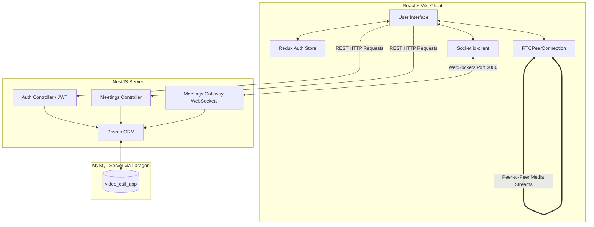

# 🌐 MeetSync: Full-Stack WebRTC Video Call App Architecture Guide

Welcome to the **MeetSync** developer guide! This document explains how the React frontend and NestJS backend interact to create a real-time peer-to-peer video calling platform using **WebSockets**, **WebRTC**, and **Prisma MySQL**.

---

## 📋 Table of Contents
1. [High-Level Architecture & Flow](#-high-level-architecture--flow)
2. [Backend Architecture (NestJS + Prisma)](#-backend-architecture-nestjs--prisma)
3. [Frontend Architecture (React + Vite + Redux)](#-frontend-architecture-react--vite--redux)
4. [Real-Time Signaling Flow (Socket.io)](#-real-time-signaling-flow-socketio)
5. [WebRTC Connection Establishment Flow](#-webrtc-connection-establishment-flow)
6. [Core Packages & Their Purpose](#-core-packages--their-purpose)
7. [🔍 Future Debugging & Troubleshooting Guide](#-future-debugging--troubleshooting-guide)

---

## 🗺️ High-Level Architecture & Flow

MeetSync runs as a client-server architecture with two main components and a database:
1. **Frontend (React + Vite)**: Renders the user interface, handles media stream access (camera and microphone), and establishes direct peer-to-peer audio/video connections (WebRTC).
2. **Backend (NestJS)**: Serves as a REST API for authentication and rooms, and coordinates WebSockets as a **signaling server** to pair up participants.
3. **Database (MySQL + Prisma)**: Persists accounts, meeting logs, active participants, and chat message history.



---

## 🏗️ Backend Architecture (NestJS + Prisma)

The NestJS backend is split into logical modules:

### 1. `prisma` Module
* **Path**: `/backend/src/prisma`
* **Purpose**: Coordinates communication with MySQL.
* **How it works**: Uses `PrismaClient` and a custom adapter `PrismaMariaDb` configured inside `/backend/src/prisma/prisma.service.ts` to connect to the database configured in `/backend/.env`.

### 2. `auth` Module
* **Path**: `/backend/src/auth`
* **Purpose**: Handles user sign-up, sign-in, password encryption, and JSON Web Token (JWT) generation.
* **How it works**: Uses `bcrypt` to securely hash passwords and `@nestjs/jwt` for signing sessions.

### 3. `users` Module
* **Path**: `/backend/src/users`
* **Purpose**: Queries, creates, and updates user account profiles.

### 4. `meetings` Module
* **Path**: `/backend/src/meetings`
* **Purpose**: Manages room creation, chat history, call logs, and the **WebSocket Gateway** for real-time activities.
* **Key Files**:
  * `meetings.controller.ts`: Defines endpoints for creating guest meeting rooms (`/meetings/create`), retrieving a meeting room, or fetching chat history.
  * `meetings.service.ts`: Coordinates database updates (adding participants, updating camera/microphone states, saving messages to the database).
  * `meetings.gateway.ts` (CRITICAL): The **Signaling Server**. It listens to client socket events and broadcasts actions (mute, video toggle, hand raises, chats, and WebRTC handshakes) to other room members.

---

## 🎨 Frontend Architecture (React + Vite + Redux)

The frontend is an optimized single-page React app:

### 1. Store & State Management
* **Path**: `/frontend/src/store.js` & `/frontend/src/features/authSlice.js`
* **Purpose**: Manages globally shared states like the currently logged-in user profile, JWT token status, and login state. Uses `@reduxjs/toolkit` and `react-redux`.

### 2. Routing (`react-router-dom`)
* **Path**: `/frontend/src/App.jsx`
* **Key Routes**:
  * `/login` & `/register`: Handles user access.
  * `/`: Home dashboard to start or join a meeting.
  * `/room/:roomId`: The primary calling arena (`MeetingRoom.jsx`).

### 3. Reusable UI Components
* **`ProtectedRoute.jsx`**: Restricts certain pages (like the Home Dashboard) to logged-in users only.
* **`PublicRoute.jsx`**: Redirects authenticated users away from the Login/Register screens automatically.

---

## ⚡ Real-Time Signaling Flow (Socket.io)

Since WebRTC operates **directly between users' web browsers**, the browsers need a way to find each other and establish a connection. This is done through **Signaling** via WebSockets:

```
Participant A (Browser)            NestJS Gateway (Server)            Participant B (Browser)
          |                                   |                                   |
          |-------- emit("join-room") ------->|                                   |
          |                                   |-------- emit("user-joined") ----->|
          |                                   |<------- emit("users-in-room") ----|
          |                                   |                                   |
          |------- emit("webrtc-offer") ----->|                                   |
          |                                   |------- emit("webrtc-offer") ----->|
          |                                   |                                   |
          |                                   |<------ emit("webrtc-answer") -----|
          |<------ emit("webrtc-answer") -----|                                   |
          |                                   |                                   |
          |<=== Direct Peer-to-Peer Media Connection (Audio, Video, Chat) ===>|
```

### Key Gateway Events (Defined in `meetings.gateway.ts`):
1. **`join-room`**: Adds the participant's socket to the Socket.io room and registers them in the MySQL database.
2. **`send-message`**: Triggered when a participant types in chat. The backend saves the message to MySQL and broadcasts it to all room members using `server.to(roomId).emit('message')`.
3. **`toggle-mute` / `toggle-camera` / `raise-hand`**: Synchronizes states between users' grid views and stores the new status in the database.
4. **`ask-to-join` / `admit-user` / `deny-user`**: Provides host-admission permission flows (like Google Meet) for guests trying to enter rooms.

---

## 🎥 WebRTC Connection Establishment Flow

Within `MeetingRoom.jsx`, the browser creates `RTCPeerConnection` objects for each peer in the room.

1. **Accessing Camera/Microphone**: The frontend executes `navigator.mediaDevices.getUserMedia({ video: true, audio: true })` to capture the webcam and microphone streams.
2. **Generating SDP Offer**: The host/first browser generates a cryptographic description of its media formats called a **Session Description Protocol (SDP) Offer** and sends it over `webrtc-offer` via the socket.
3. **Generating SDP Answer**: The receiver browser receives this offer, generates an **SDP Answer**, and sends it back over `webrtc-answer`.
4. **Exchanging ICE Candidates**: The browsers exchange network paths (**ICE Candidates**) via `webrtc-ice-candidate` to discover the fastest direct communication route (P2P).
5. **Direct Streaming**: Once connected, streams are attached to `<video>` elements in the UI.

---

## 📦 Core Packages & Their Purpose

Here is a quick reference table showing exactly what package does what in MeetSync:

### Backend Dependencies (`backend/package.json`)
| Package Name | Category | Primary Feature / Purpose |
| :--- | :--- | :--- |
| **`@nestjs/core` & `@nestjs/common`** | Core framework | Structured backend framework (dependency injection, controllers, providers). |
| **`@prisma/client`** | Database | Type-safe database client representing models as TypeScript objects. |
| **`@prisma/adapter-mariadb`** | Database | Adapts Prisma queries to work with MariaDB/MySQL drivers. |
| **`mysql2` & `mariadb`** | Database drivers | Low-level drivers that allow Node.js to talk to Laragon MySQL. |
| **`bcrypt`** | Security | Hashes passwords securely during register, and validates hashes during login. |
| **`@nestjs/jwt` & `passport-jwt`** | Authentication | Generates and verifies session JWTs, securing private endpoints. |
| **`@nestjs/websockets` & `socket.io`** | Real-Time | Powers WebSocket rooms, instant chat, states sync, and WebRTC signal routing. |

### Frontend Dependencies (`frontend/package.json`)
| Package Name | Category | Primary Feature / Purpose |
| :--- | :--- | :--- |
| **`react` & `react-dom`** | UI | The core component architecture powering the application's view. |
| **`@reduxjs/toolkit` & `react-redux`** | State Management | Centralized reactive store for user session tokens and credentials. |
| **`react-router-dom`** | Navigation | Directs users smoothly between Home, Room, Login, and Signup screens. |
| **`socket.io-client`** | Real-Time | Connects browser socket client to backend NestJS WebSocket gateway. |
| **`axios`** | HTTP Requests | Performs REST HTTP API queries (such as signup, login, and room fetches). |
| **`tailwindcss`** | CSS Styling | Provides utility classes to build modern, beautiful, and responsive styling instantly. |
| **`uuid`** | Utilities | Generates random unique Room IDs for instant meetings. |

---

## 🔍 Future Debugging & Troubleshooting Guide

If you run into issues during development or deployment, use this reference to locate and resolve them quickly:

### 1. Database & Prisma Connection Issues
* **Symptoms**: `P1001: Can't reach database server` or backend startup crashes on database query.
* **Steps to solve**:
  1. Open Laragon and ensure MySQL is running (green status).
  2. Inspect `/backend/.env` and double check the username, password, and port in `DATABASE_URL`.
  3. Try connecting to the database using a tool like **HeidiSQL** (pre-installed in Laragon) to verify your credentials.
  4. Run `npx prisma db pull` or `npx prisma db push` to verify manual connectivity.

### 2. TypeScript Compilation Errors after Schema Changes
* **Symptoms**: TypeScript complains that property `xyz` does not exist on `this.prisma.user` or other models.
* **Steps to solve**:
  1. Whenever you edit `/backend/prisma/schema.prisma`, you MUST regenerate the prisma node module.
  2. Run:
     ```bash
     npx prisma generate
     ```
  3. Restart your backend dev server (`npm run start:dev`) so it picks up the refreshed client definitions.

### 3. Real-Time Chat or Signaling Fails (WebSockets)
* **Symptoms**: Chat messages do not send, camera toggles do not sync, or other participants don't see media.
* **Steps to solve**:
  1. Look at your browser's Developer Console (`F12`) under the **Console** and **Network -> WS** tabs.
  2. Check if the socket connection is blocked (e.g., cors blocker).
  3. Ensure the gateway in `meetings.gateway.ts` has `@WebSocketGateway({ cors: { origin: '*' } })` so it allows connections.
  4. Ensure both frontend and backend are matching ports (e.g. backend port `3000`, frontend proxy targeting `3000`).

### 4. WebRTC Video/Audio Failing to Connect (P2P)
* **Symptoms**: Users join the room but only see black/empty video frames for other participants.
* **Steps to solve**:
  1. Check if the browser has camera/mic permissions granted.
  2. Open the console (`F12`) and look for WebRTC failures (e.g., failed to set local/remote descriptions).
  3. When running over the local network (across different devices), WebSockets and WebRTC **require HTTPS or localhost** to access user media. Use a tool like **Ngrok** or configure local certificates for local network testing.
  4. For production, you will need to add **STUN/TURN** servers inside the `RTCPeerConnection` iceServers config inside `/frontend/src/pages/MeetingRoom.jsx` to bypass strict firewalls (symmetric NATs).

---

🚀 **Happy coding! You are now fully equipped to build and maintain MeetSync like a pro!**
